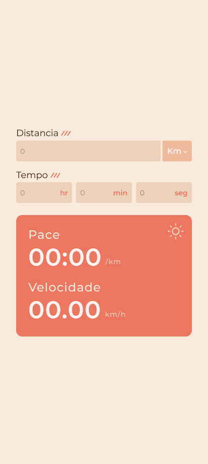
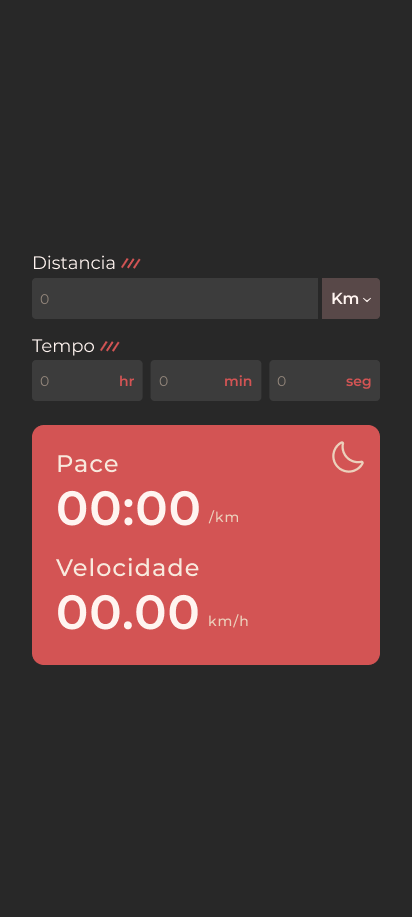

<h1 align="center"> Calculadora de Pace </h1>

Esse site foi desenvolvido como um projeto pessoal para auxiliar os meus cálculos de pace na corrida.

  <a href="#-tecnologias">Tecnologias</a>&nbsp;&nbsp;&nbsp;|&nbsp;&nbsp;&nbsp;
  <a href="#-projeto">Projeto</a>&nbsp;&nbsp;&nbsp;|&nbsp;&nbsp;&nbsp;
  <a href="#memo-licença">Licença</a>

  

 

  
  

## 🚀 Tecnologias

Esse projeto foi desenvolvido com as seguintes tecnologias:

- React
- SASS
- Git e Github

## 💻 Projeto

Este site é uma calculadora de pace que pode ser utilizado por corredores.

- [Visite o projeto online](https://pace-calculator.vercel.app/)

## 📝 Licença

Esse projeto está sob a licença MIT.
